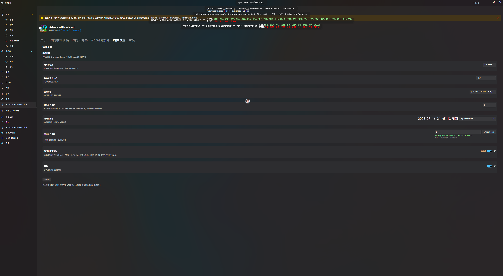

# AdvancedTimeIsland

在ClassIsland自动化添加支持高级触发时间的插件

> \[!caution]
>
> # 免责声明
>
> 插件内包含大量文本输入框，插件作者不对使用者在其中输入的内容做任何担保，如果使用者因输入不当内容导致造成不良影响，使用者需自行承担相关责任，插件作者概不负责。

> \[!caution]
> 本项目的代码将由AI生成，本项目能够保证的是功能正常 ~~（图标是人类做的，部分文案是AI生成的，介绍也是）（这句话也是人类写的）~~

## 大饼

# 大饼（功能规划）

## 1. 主界面

- [X] 中○ 添加显示、指定经度的地方时
- [X] 中○ 添加显示 指定时区的区时
- [X] 短○ 更好的日期：支持显示 年-月-日，周\_/周\_ 年-月-日（YYYY-MM-DD）
- [X] 长○ 更好的多农历倒计时（支持设置多例倒计时，目标时间精确到秒，按照从近到远自动排序，倒计时到达后自动换下一个，若没有则提示"倒计时已结束"；支持每例倒计时独立控制是否通知及内容及时长）
- [X] 长○ 更好的多倒计时（支持设置多例倒计时，目标时间精确到秒，按照从近到远自动排序，倒计时到达后自动换下一个，若没有则提示"倒计时已结束"；支持每例倒计时独立控制是否通知及内容及时长）

## 2. 自动化/超级汽车岛

### (1) 触发器（Trigger）

- [X] 短 ○ 精确时间是(YYYY-MM-DD-hh-mm-ss)
- [X] 中 ○ 在每年的(MM-DD-hh-mm-ss)触发（2月29日则是每闰年）
- [X] 中 ○ 在每周的周\_\_，(hh-mm-ss)触发
- [X] 中 ○ 在每天的(hh-mm-ss)触发
- [X] 中 ○ 在每小时的(mm-ss)触发
- [X] 中 ○ 在每分钟的(ss)触发
- [X] 中 ○ 在绝对时间(unix时间戳)触发（单位为秒,注意需用64位有符号整数）（精确到整数）
- [X] 中 ○ 在每月的(DD-hh-mm-ss)触发（若当月不存在该日则跳过）
- [X] 长 ○ 在精确农历日期(L\_YYYY-L\_MM-L\_DD-hh-mm-ss)触发（考虑闰月）
- [X] 长 ○ 在每农历年(L\_MM-L\_DD-hh-mm-ss)触发
- [X] 长 ○ 在农历每月(L\_DD-hh-mm-ss)（选“三十”则是每大月，选“初一～廿九”则每月）（当年不存在该日则跳过）
- [X] 长 ○ 在每农历年(L\_MM)的倒数第n天(hh-mm-ss)触发
- [X] 长 ○ 在\[经度]地方时的\[YYYY-MM-DD-hh-mm-ss]触发
- [X] 长 ○ 在\[时区]区时的(YYYY-MM-DD-hh-mm-ss)触发
- [X] 长 ○在\[经度]地方时每月\[DD-hh-mm-ss]触发
- [X] 长 ○在\[时区]区时每月\[DD-hh-mm-ss]触发
- [X] 长 ○在\[经度]地方时每周\[周\_-hh-mm-ss]触发
- [X] 长 ○在\[时区]区时每周\[周\_-hh-mm-ss]触发
- [X] 长 ○在\[经度]地方时每天\[hh-mm-ss]触发
- [X] 长 ○在\[时区]区时每天\[hh-mm-ss]触发
- [X] 长 ○在\[经度]地方时每小时\[mm-ss]触发
- [X] 长 ○在\[经度]地方时每分钟\[ss]触发
- [X] 长 ○接入SuperAutoIsland blockly

### (2) 条件

- [X] 短 ○ 精确时间在范围\[YYYY-MM-DD-hh-mm-ss]₁ \~ \[YYYY-MM-DD-hh-mm-ss]₂内
- [X] 中 ○ 在每年的\[MM-DD-hh-mm-ss]₁ \~ \[MM-DD-hh-mm-ss]₂内
- [X] 中 ○ 在每月的\[DD-hh-mm-ss]₁ \~ \[DD-hh-mm-ss]₂内
- [X] 中 ○ 在每天的\[hh-mm-ss]₁ \~ \[hh-mm-ss]₂内
- [X] 中 ○ 在每小时的\[mm-ss]₁ \~ \[mm-ss]₂内
- [X] 中 ○ 在每分钟的\[ss]₁ \~ \[ss]₂内
- [X] 长 ○ 在\[经度]地方时间上面6条
- [X] 长 ○ 在\[时区]区时间同前4条
- [X] 长 ○ 在农历\[L\_YYYY-L\_MM-L\_DD-hh-mm-ss]₁ \~ \[L\_YYYY-L\_MM-L\_DD-hh-mm-ss]₂内
- [X] 长 ○ 在农历每年\[L\_MM-L\_DD-hh-mm-dd]₁ \~ \[L\_MM-L\_DD-hh-mm-ss]₂内
- [X] 长 ○ 在农历每月\[L\_DD-hh-mm-ss]₁ \~ \[L\_DD-hh-mm-ss]₂内
- [X] 中 ○ 在绝对时间(unix时间戳)指定范围内(单位为秒,支持小数，精确到3位小数，需64位有符号浮点数)

### (3) 行动

- [X] 中 ○ 从服务器同步ClassIsland时间

## 3. 设置页面

### 顶部通用区域

- [X] 左侧：标注「\[图标]」的方形图标占位框
- [X] 右侧第一行：插件名称「AdvancedTimeIsland」
- [X] 右侧第二行：作者 ID「inf2147483647」+ 按钮「项目主页」
- [X] 标签导航栏：关于 | 时间格式转换 | 插件设置 | 专业名词解释

### (1) 关于

- [X] 显示作者：inf2147483647
- [X] 显示版本：1.0.0.0
- [X] 显示介绍：一个好的插件，先从它的介绍开始

### (2) 时间格式转换

- [X] 清空按钮：单击‘清空’可清除下方输入框全部内容

#### 北京时间转换模块

- [X] 标签：北京时间
- [X] 日期输入框（格式年/月/日/星期；默认空，点击弹出日期选择，选择后替换）
- [X] 时间选择框（默认空）
- [X] 按钮「选取当前时间」
- [X] 转换按钮：转为 Unix 时间戳
- [X] 转换按钮：转为农历
- [X] 转换按钮：转为区时
- [X] 转换按钮：转为地方时

#### Unix 时间戳转换模块

- [X] 标签：Unix 时间戳
- [X] 输入框（仅整数，默认空）
- [X] 按钮「复制」
- [X] 转换按钮：转为北京时间
- [X] 转换按钮：转为农历
- [X] 转换按钮：转为区时
- [X] 转换按钮：转为地方时

#### 农历转换模块

- [X] 标签：农历
- [X] 年份下拉框（默认1984-2043，可选范围：1924-1983；1984-2043；2044-2103）
- [X] 天干下拉框（默认空，甲～癸）
- [X] 生肖下拉框（默认空，子～亥）
- [X] 月份下拉框（默认空，需处理闰月）
- [X] 日期下拉框（默认空）
- [X] 时间选择框（默认空）
- [X] 转换按钮：转为北京时间
- [X] 转换按钮：转为 Unix 时间戳
- [X] 转换按钮：转为区时
- [X] 转换按钮：转为地方时

#### 区时转换模块

- [X] 标签：区时
- [X] 日期输入框（格式年/月/日/星期；默认空，点击日期选择替换）
- [X] 时间选取框（默认空）
- [X] 时区下拉框（默认「中时区」，范围西十二区～东十二区）
- [X] 转换按钮：转为北京时间
- [X] 转换按钮：转为 Unix 时间戳
- [X] 转换按钮：转为农历
- [X] 转换按钮：转为地方时

#### 地方时转换模块

- [X] 标签：地方时
- [X] 日期输入框（格式年/月/日/星期；默认空，点击日期选择替换）
- [X] 时间选取框（默认空）
- [X] 经度输入框（度，3位小数，正东经负西经，取值范围(-180,180]，转换结果四舍五入到秒）
- [X] 转换按钮：转为北京时间
- [X] 转换按钮：转为 Unix 时间戳
- [X] 转换按钮：转为农历
- [X] 转换按钮：转为区时

#### 注意事项

- [X] 提示：转为区时/地方时前，需先选好对应的时区/经度，然后再转换
- [X] 提示：试试连续点顶部通用区域的图标
- [X] 提示：经度处填正数为东经，负数为西经，取值范围为 (-180, 180]

### (3) 插件设置

- [X] 启用农历功能：右侧开关按钮（默认开启）
- [X] 启用区时 / 地方时：右侧开关按钮（默认开启）
- [X] 时间基准：右侧下拉选择框（默认「ClassIsland」，可选：ClassIsland、系统）
- [X] 女装：右侧开关按钮（默认不可见，触发彩蛋后可见且状态开启，关闭后重启恢复不可见）

### (4) 专业名词解释

- [X] 使用 Markdown 解释 Unix 时间戳（含示例：北京时间2026-6-6 12:00:00 → 1780718400）
- [X] 使用 Markdown 解释闰秒（定义，调整规则，加在年末或六月末）
- [X] 使用 Markdown 解释区时（按经度划分24时区，中央经线地方平太阳时，相邻时区差1小时，例：东八区）
- [X] 使用 Markdown 解释时区（经度划分，全球24时区，跨15°，中国用东八区作为国家标准时）

# 接下来的规划

现在上面的功能已经基本实现，现在将会降低开发频率，实现以下功能

- [X] 主界面组件：周期性倒计时
- [ ] 主界面组件：自适应倒计时
- [ ] 主界面组件：农历日期（很多插件都实现了）
- [ ] 开发linux版本 ~~(介于为啥没有Mac版本，手头实在没有苹果设备可供测试了)~~
- [ ] 重新设计UI
- [ ] 新增桌面时间表悬浮窗（置底）
- [ ] 开发CI 1.7版
- [ ] 管理启用的功能（issue #1）
- [ ] 就先镇多吧，插件上架后以优化为主，欢迎issue，优化使用体验；一下子吃很多消化不了

本项目基于 GNU Lesser General Public License v3.0 获得许可
